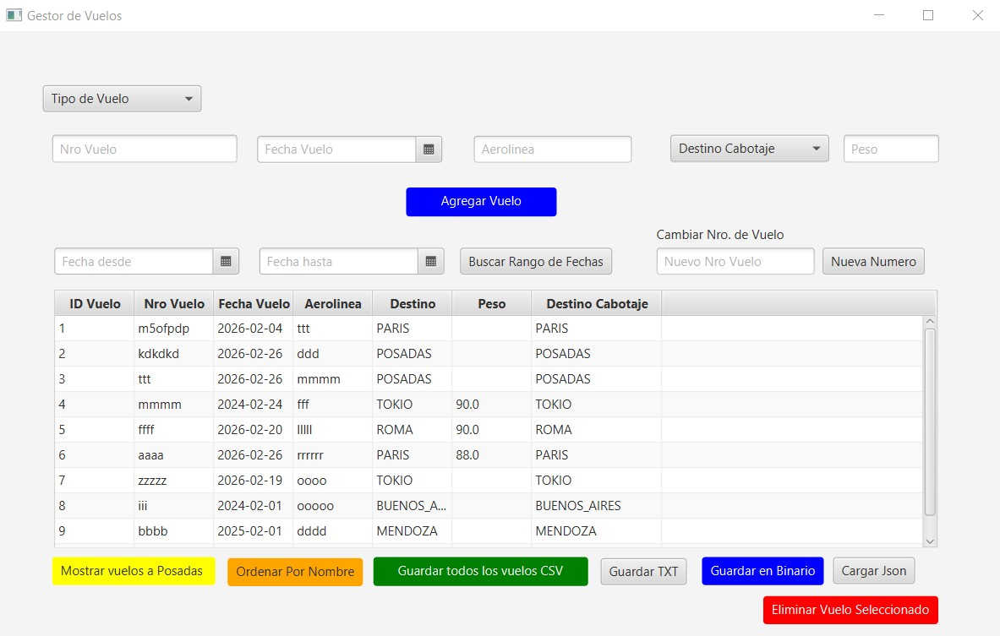
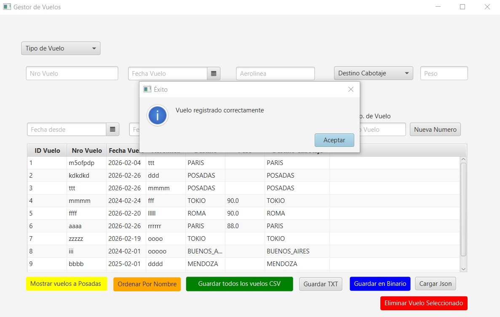
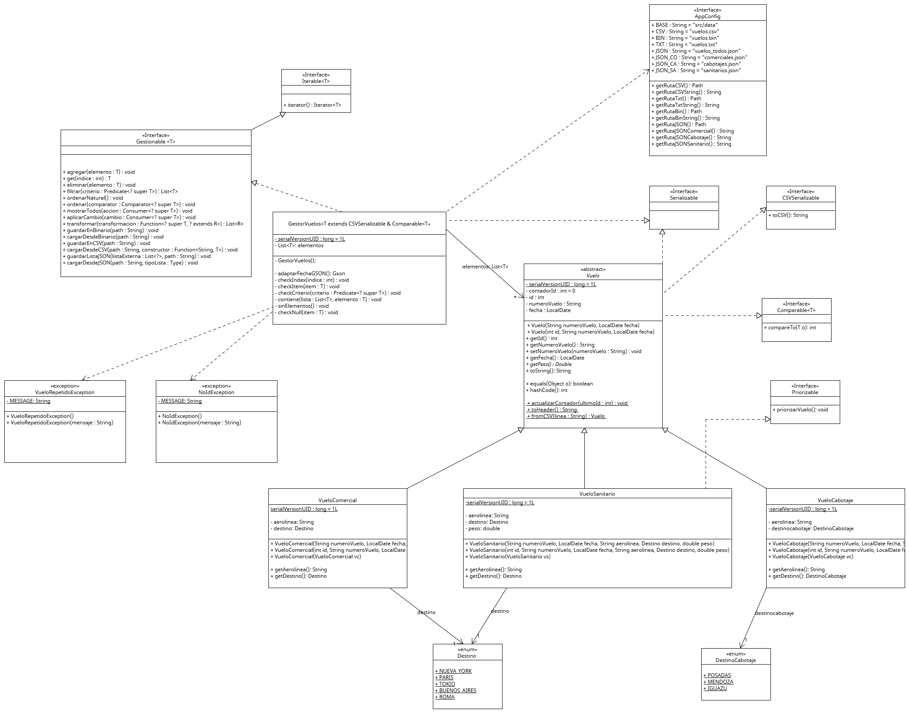

# CRUD - Vuelos

## Sobre mí:

Hola mi nombre Hector Andres Nazadek Soy estudiante de programación y este proyecto es el resultado de mi examen final de Java.

## Sobre la Aplicación
Bueno en resumen la aplicacion se trata de un sistema para gestionar vuelos Vuelos Comerciales de Cabotaje y Sanitarios.
la misma permite agendar nuevos vuelos con un ID unico auto Incremntal con sus datos como número de vuelo, nombre de aerolinea y fechas.
La misma tambien permite la visualizacion en una grilla cargada desde un archivo csv permitiendo filtrados , edicion y eliminacion de vuelos.

### Capturas de la Interfaz

*Panel de control y listado de vuelos.*

*Detalle de la carga de datos y validaciones.*

*Detalle de la carga de datos y validaciones.*
