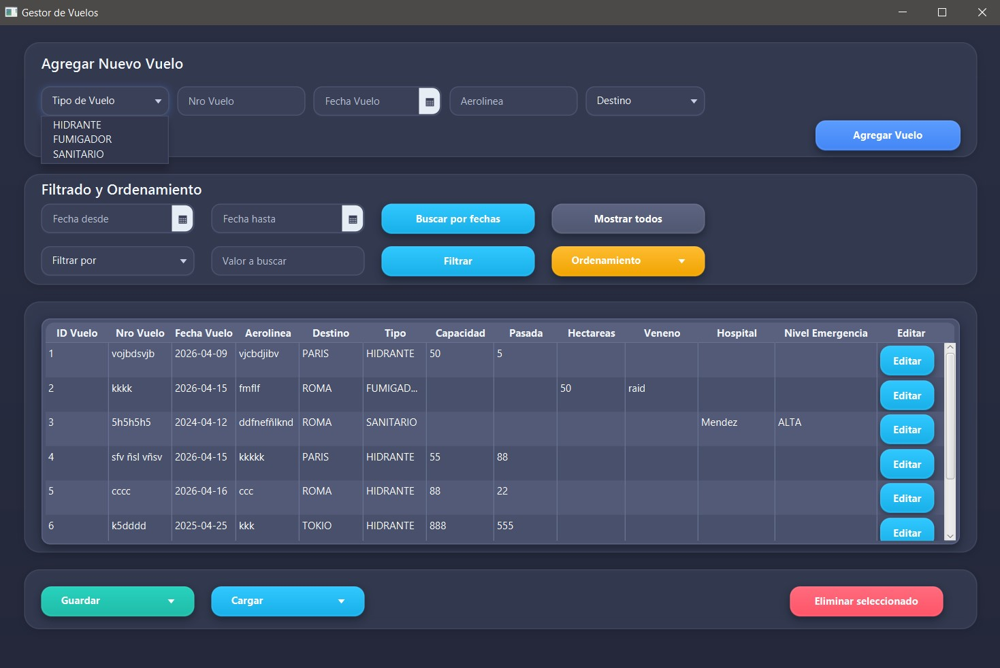
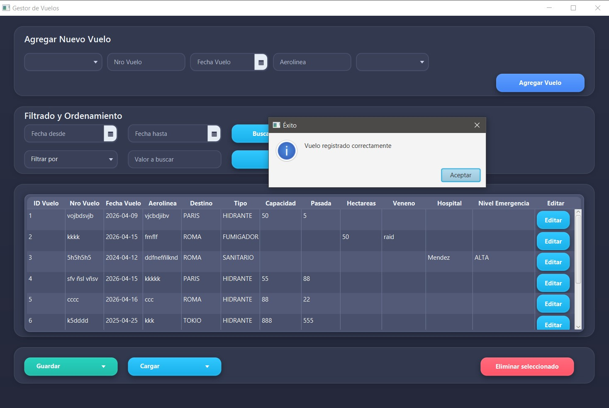
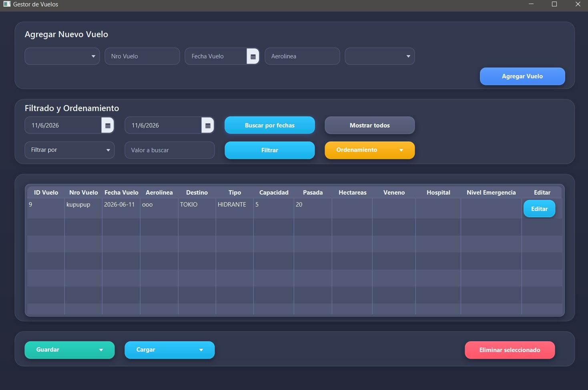
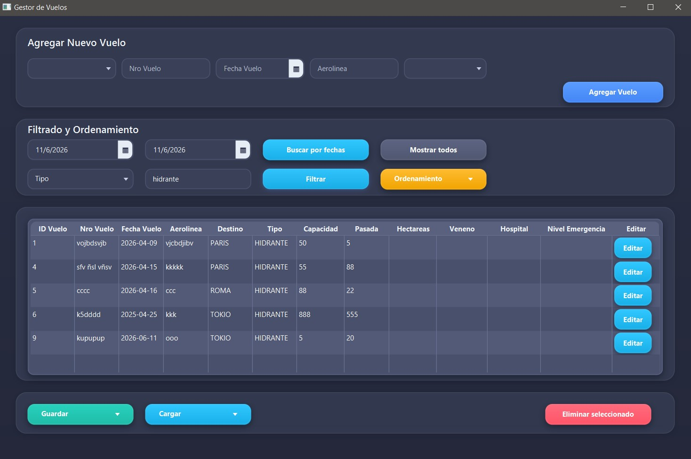
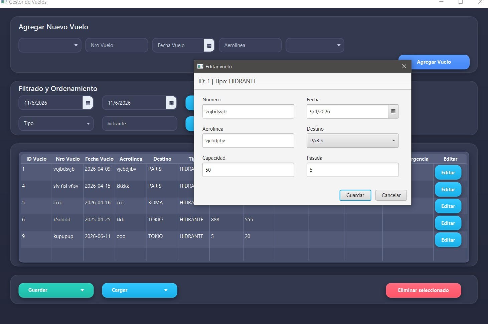
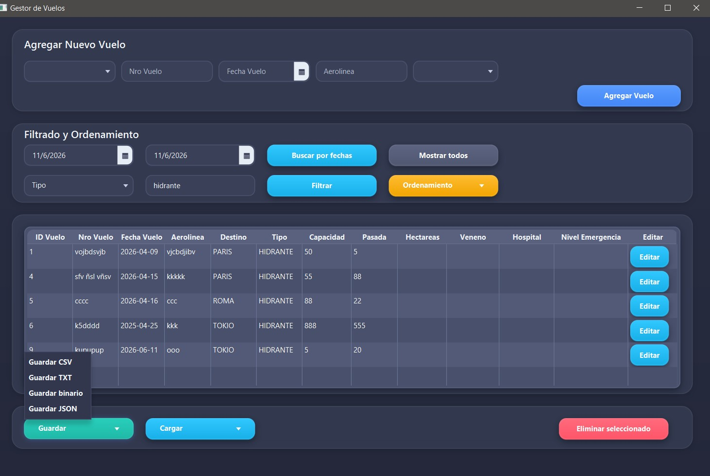
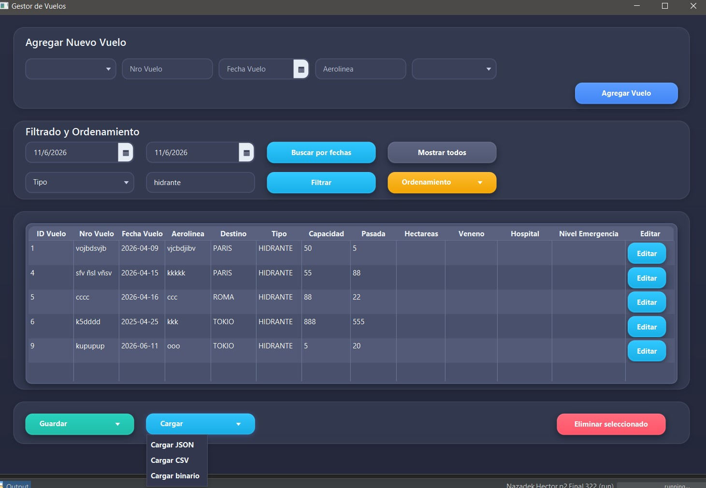
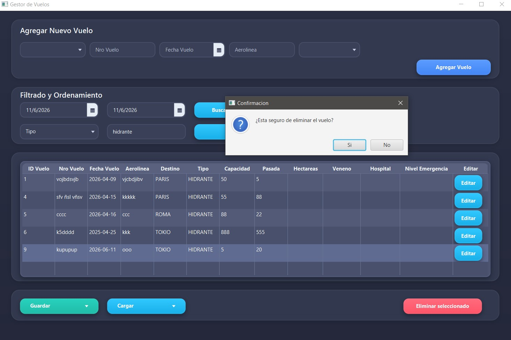
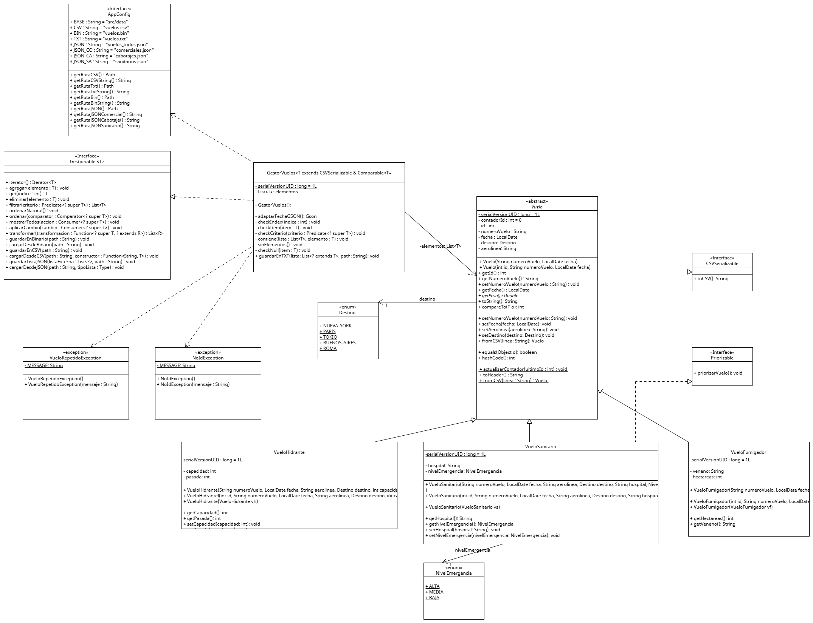

# CRUD - Vuelos

## Sobre mí

Hola, mi nombre es Héctor Andrés Nazadek. Soy estudiante de programación y este proyecto corresponde al examen final de Java para Programación II.

## Sobre la Aplicación

La aplicación es un sistema de gestión de vuelos desarrollado en JavaFX. Permite registrar, listar, editar, eliminar, filtrar, ordenar, guardar y cargar vuelos.

El sistema trabaja con distintos tipos de vuelo:

- Hidrante
- Fumigador
- Sanitario

Cada vuelo posee un ID único autoincremental, número de vuelo, fecha, aerolínea, destino y atributos específicos según su tipo.

## Funcionalidades principales

- Alta de nuevos vuelos.
- Visualización de vuelos en una tabla.
- Edición de vuelos desde un popup.
- Eliminación con confirmación.
- Filtrado por fechas.
- Filtrado por atributos específicos.
- Ordenamiento por distintos criterios.
- Guardado en CSV, TXT, binario y JSON.
- Carga desde CSV, binario y JSON.

## Capturas de la Interfaz

### 1. Selección del tipo de vuelo

Desde el formulario principal se puede seleccionar el tipo de vuelo a registrar. Según el tipo elegido, la interfaz muestra los campos específicos correspondientes.

### 2. Registro exitoso

Luego de completar los datos requeridos y presionar `Agregar Vuelo`, el sistema registra el vuelo y muestra una alerta de confirmación.

### 3. Búsqueda por fechas

La aplicación permite filtrar vuelos entre dos fechas seleccionadas desde los campos `Fecha desde` y `Fecha hasta`.

### 4. Filtro por atributo

También se puede filtrar por atributos como tipo, destino, aerolínea, número de vuelo, hospital, nivel de emergencia, capacidad, pasada, hectáreas o veneno.

### 5. Edición de vuelo

Cada fila de la tabla posee un botón `Editar`, que abre un popup para modificar los datos del vuelo seleccionado sin cambiar su ID ni su tipo.

### 6. Guardado de datos

El menú `Guardar` permite persistir los datos en distintos formatos: CSV, TXT, binario y JSON.

### 7. Carga de datos

El menú `Cargar` permite recuperar información previamente guardada desde archivos JSON, CSV o binarios.

### 8. Eliminación de vuelo

Para eliminar un vuelo, se selecciona una fila y se presiona `Eliminar seleccionado`. El sistema solicita confirmación antes de borrar el registro.

## Diagrama UML

El diagrama representa la estructura principal del proyecto, incluyendo la clase abstracta `Vuelo`, sus clases derivadas, interfaces, enumerados, gestor genérico, excepciones y relaciones principales.

## Archivos generados

La aplicación genera archivos de ejemplo en distintos formatos:

- `.csv` para persistencia en texto separado por comas.
- `.txt` como reporte legible.
- `.bin` para serialización binaria.
- `.json` para guardar y recuperar vuelos por tipo.
